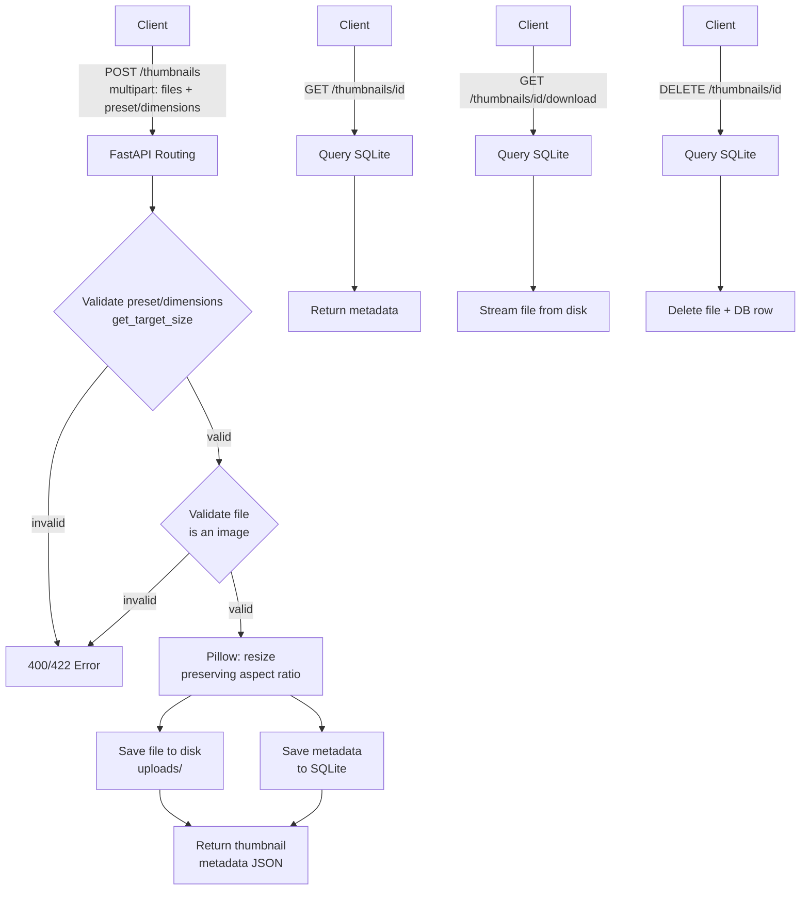

# Thumbnail API

REST API for uploading images and generating resized thumbnails, via presets or custom dimensions.

## Architecture

## Setup

1. `python3 -m venv venv && source venv/bin/activate`
2. `pip install -r requirements.txt`
3. `uvicorn main:app --reload`
4. Visit `http://localhost:8000/docs`

## Testing

`python3 -m pytest`

- **Unit tests** (`tests/test_unit.py`): isolated tests on `get_target_size`, the preset/dimension resolution logic — no HTTP, no database
- **Integration tests** (`tests/test_main.py`): full request/response flow via TestClient, covering upload, retrieval, download, and error cases

## Design Decisions

- **FastAPI + Pillow**: FastAPI for automatic validation/docs; Pillow is the standard Python image processing library — `image.thumbnail(max_size)` resizes while automatically preserving aspect ratio
- **SQLite for metadata, local disk for files**: zero setup cost for this exercise; would use Postgres + object storage (DigitalOcean Spaces / S3) in production
- **Presets as a fixed dict** (small/medium/large -> max dimensions): simple, explicit, easy to extend
- **Concurrency**: FastAPI/Starlette run on an async event loop, handling multiple simultaneous requests without blocking. For CPU-bound resize work at real scale, I'd offload to a background worker/thread pool to avoid blocking the event loop; for this exercise's scope, Pillow's resize is fast enough to run inline

## Known Limitations

- Local disk storage — files won't persist across redeploys on most cloud platforms (ephemeral filesystem). Production would use object storage.
- No authentication
- No pagination on any future "list all thumbnails" endpoint (not currently implemented)
- No rate limiting on uploads

## What I'd Add With More Time

- Object storage (DigitalOcean Spaces) instead of local disk, for persistence and to support multiple app instances
- Background job processing (Celery/queue) for resize work, so upload response is instant and resizing happens async
- Authentication and per-user upload quotas
- Batch upload endpoint (accept multiple files in one request, per "one or more images" in the prompt)
